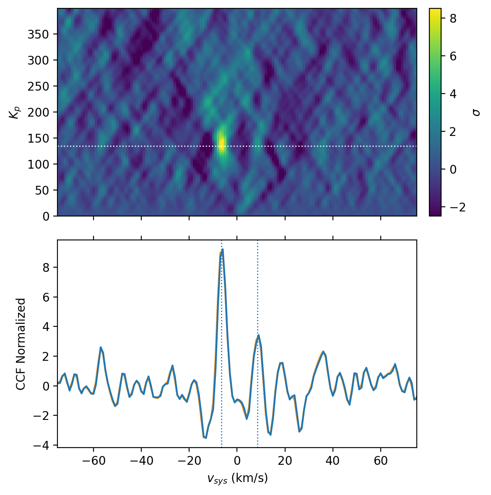

# WASP-127b CO and H2O detection
- __Authors__: Nathan Besch, Neil Gibson
- __Date__: June - July 2024

To investigate the double detection feature in the $K_p-v_{sys}$ cross-correlation map of WASP-127b's CRIRES+ data, we reproduced the work of [Nortmann et al (2025)][nortmann]. We modelled an atmosphere possessing H2O and CO with petitREADTRANS using the planetary system parameters and cross correlated that model with the atmospheric signal. The latter was obtained using the Sysrem pipeline to remove telluric and stellar signals. Although we were not able to obtain a similarly strong double detection feature, we found CO and H2O at approximately $v_{sys}=$ 6.5 km.s $^{-1}$.

Example: $K_p - v_{sys}$ cross-correlation map with detection significance of CO and H2O derived from this analysis.

## List of notebooks
| Notebook | View |
|----------|:----:|
| [WASP-127b Atmosphere Modelling][atm]             | [![NB viewer][nbviewer]][atm_nbviewer]  |
| [Cross-correlation and detection of CO, H2O][cc]                 | [![NB viewer][nbviewer]][cc_nbviewer] |

[nortmann]: https://doi.org/10.1051/0004-6361/202450438

[nbviewer]: https://juigitlab.esac.esa.int/notebooks/planetary-coverage/-/raw/main/imgs/nbviewer.svg

[atm]: /atmosphere.ipynb
[atm_nbviewer]: https://nbviewer.jupyter.org/urls/github.com/BlueNeptune11/WASP-127b_CO_detection/blob/main/atmosphere.ipynb

[cc]: /cross_correlation.ipynb
[cc_nbviewer]: https://nbviewer.jupyter.org/urls/github.com/BlueNeptune11/WASP-127b_CO_detection/blob/main/cross_correlation.ipynb
